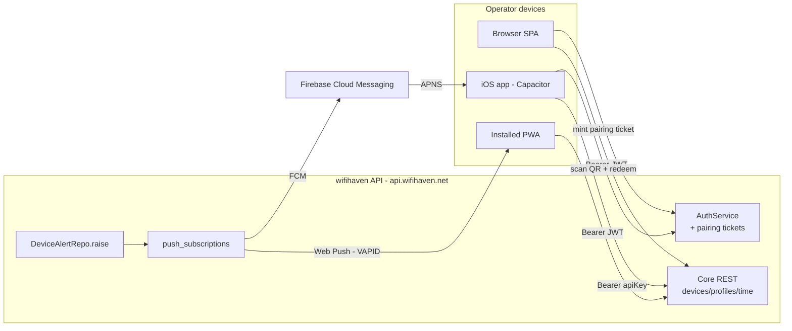
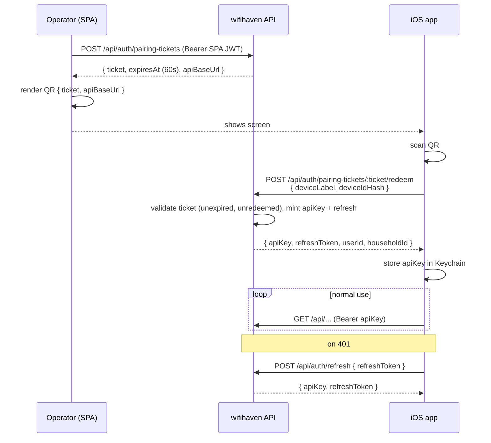

# iOS Mobile App — Design (#979)

Scoping doc for an iOS operator surface on wifihaven. Decisions on Q1-Q7 from
the parent issue, plus the work breakdown that the sub-issues track.

## TL;DR

Staircase: ship a PWA-as-app first (low-cost validation on top of the existing
responsive SPA), graduate to a Capacitor wrapper once iOS Safari Web Push
proves insufficient or once we want first-class APNS + App Store presence.
Skip a native Swift rewrite unless the SPA UX visibly fails on iOS. Auth via
device-bound API key minted by a QR pairing flow inside the SPA. Live in the
monorepo under `mobile/`, share types with the SPA via `shared/`.

---

## Q1 — Native vs PWA-as-app vs wrapper

**Decision: Staircase. (a) PWA-as-app first → (b) Capacitor when push needs
more → (c) defer native indefinitely.**

The SPA is already responsive (PR #918 / #861) and uses a Bearer-token auth
model (`web/src/api/client.ts:31`, `web/src/hooks/useAuth.tsx:6`) that maps
cleanly onto a mobile shell. A PWA needs only a manifest + service worker on
top of what exists. iOS 16.4+ supports Web Push for installed PWAs, which
covers the v1 "phone in pocket" cases without an Apple Developer account.

We move to Capacitor only when one of these triggers: (1) Safari Web Push
proves flaky for our notification volume; (2) we want App Store discovery /
TestFlight distribution; (3) we need native features (biometrics gate,
deep-linked share extensions, background fetch). Capacitor lets us reuse the
SPA bundle and the existing `web/` build wholesale — the wrapper is a thin
native shell, not a rewrite.

Native SwiftUI is rejected: the SPA already covers the surfaces a v1 operator
app needs, the maintenance overhead of a parallel native codebase is large,
and the UX wins do not justify it unless evidence demonstrates otherwise.

## Q2 — v1 surfaces

**Decision: monitor + quick actions only. v1 ships:**

- Dashboard NOW (PR #919) — read-only at-a-glance.
- Per-profile screen-time view + `+Time` (`web/src/pages/TimePage.tsx`).
- New-device alert + assign-profile flow (#711 already in SPA).
- Pause / unpause profile.
- Push for: new device (#711), kid extension request (#960), big block
  events (#374).

**v2 (deferred):** Connection Events + Traffic Usage observability pages
(dense on a phone), profile/apps/blocklist heavy edit forms. The kid-side
block-page flow (#960) is a separate surface — kids hit it from their own
device, not the operator app.

## Q3 — Auth

**Decision: device-bound API key minted via in-SPA QR pairing, with
refresh-token semantics and an optional Face ID gate on app open.**

Today the SPA uses `POST /auth/login` returning a JWT (`AuthService.scala:36`,
`useAuth.tsx`). The mobile app should not ship password entry — that's a
bad household-device experience and the second factor is "you possess the
parent's already-authed laptop".

Flow:

1. Operator opens **Settings → Pair phone** in the SPA. SPA calls
   `POST /api/auth/pairing-tickets`, receives a short-lived (60s)
   single-use ticket, renders it as a QR code (ticket + API base URL).
2. iOS app scans the QR. App posts the ticket + a device label + the OS
   device-id hash to `POST /api/auth/pairing-tickets/:id/redeem`, receives
   `{ apiKey, refreshToken, userId, householdId }`. Ticket burns on first
   redeem.
3. App stores `apiKey` in the iOS Keychain. All requests use
   `Authorization: Bearer <apiKey>`.
4. On 401, app calls `POST /api/auth/refresh` with the refresh token;
   if that fails, app prompts re-pairing.
5. Optional Face ID / Touch ID gate guards Keychain read on app launch.

Revocation: a paired-devices list under **Settings → Devices** lets the
operator revoke any device's key. Multi-tenant (#622) maps cleanly — each
key belongs to a `(userId, householdId)` pair from the start.

## Q4 — Push infrastructure

**Decision: APNS via Firebase Cloud Messaging (FCM) for the Capacitor / native
track; Web Push (#884) for the PWA track. Both share a unified
`push_subscriptions` table.**

FCM costs nothing, abstracts APNS signing-key rotation, and gives us Android
parity for free if we ever ship one. The fire-from-API logic in #884 stays the
same — `DeviceAlertRepo.raise` enumerates subscriptions and dispatches per
transport (Web Push vs FCM vs webhook #874 vs email).

We still need an Apple Developer account ($99/yr, Q6) to mint APNS auth keys
that FCM forwards on our behalf.

## Q5 — Backend gaps

Inventoried against current API. Real gaps:

- **Pairing tickets endpoint** (`POST /api/auth/pairing-tickets` + redeem).
  New. Filed as sub-issue 3.
- **Push subscription endpoint** `POST /api/push-subscriptions`. #884
  already specifies this for Web Push; broaden to accept `transport ∈
  {webpush, fcm}` and dispatch accordingly. Filed as sub-issue 5.
- **Paired-devices list + revoke** (`GET /api/auth/devices`, `DELETE
  /api/auth/devices/:id`). Filed under sub-issue 3.
- **Refresh token semantics.** The current JWT is short-ish; mobile needs
  a long-lived refresh that survives weeks of background. Filed under
  sub-issue 3.

Mobile-shaped endpoints (compact payloads) are NOT a real gap — the existing
`/api/dashboard/now` and `/api/time/status` payloads are already compact.
Revisit if Dashboard NOW grows.

Per `~/.claude` memory: API can change shape atomically with SPA, no compat
shims required.

## Q6 — App store / signing

Operator-decision points, no money committed by this doc:

- **Apple Developer Program**: $99/yr. Required for TestFlight + App Store
  + APNS keys. Cheaper alternative: AltStore / sideloading for
  household-only distribution (no $99, but reinstall every 7 days — bad UX).
- **Signing**: Fastlane Match (private repo) or Xcode Cloud. Match is the
  cheap path.
- **TestFlight**: free once enrolled. Up to 100 internal + 10k external
  testers. Household scale fits trivially in internal.
- **App Review**: wifihaven inspects household DNS + connection metadata.
  Privacy policy must disclose; expect a reviewer question. Position as
  household-network-tools (parental controls). Frame in the App Privacy
  data-collection questionnaire as "Network telemetry, linked to your
  household, not shared".
- **Bundle ID**: `net.wifihaven.app` (matches `api.wifihaven.net`).

## Q7 — Codebase + ownership

**Decision: in-monorepo `mobile/` directory; share types with the SPA via
the existing `shared/` pattern.**

`shared/` already publishes Scala models that the API and the router agent
both consume (`shared/src/Models.scala`, `shared/contract/`). For the mobile
app the relevant share point is TypeScript-from-SPA: lift the SPA's API
client (`web/src/api/client.ts`) and its DTOs into a small `web-shared/`
package (or use Capacitor's bundle which is the SPA itself, so the share is
free).

Monorepo wins: single-PR atomic API+mobile changes (no compat shims), one CI
config, one issue tracker. Separate-repo costs (independent CI, cross-repo
PRs, version skew) are not justified at household scale.

---

## Architecture



## Auth flow (QR pairing)



## Sequencing

Dependency order for the sub-issues:

```
3 (auth) ──┬─> 1 (architecture pick, end of PWA spike)
           ├─> 2 (v1 surfaces) ──> 7 (TestFlight beta)
           ├─> 5 (backend gaps: push reg + paired devices)
           └─> 4 (push infra) ──> 7

6 (app store / signing) parallel; blocks 7 only.
```

Sub-issue 3 (auth) is the keystone — every other sub-issue needs a logged-in
mobile client to demonstrate. Spawn it first.

## Out of scope

- Android. Choice of FCM in Q4 keeps the option open.
- Kid-side app. Block-page flow (#960) handles kid surface via their own
  device's browser.
- Multi-tenant UX (#622). Auth model is forward-compatible; UI deferred.
